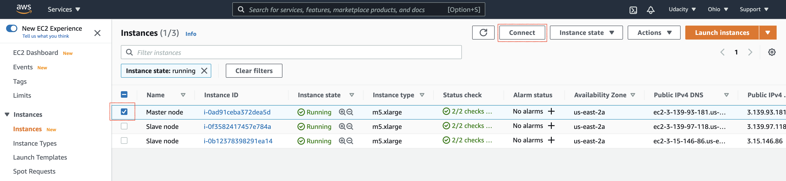
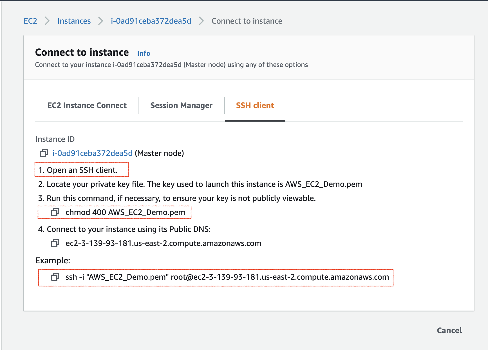

# Data-Lake-with-Spark

## Motivation
This project is the hands-on project provided by udacity data engineering nanodegree. We have original event log data and songs data storing inside AWS S3 storage, it is our goal to extract the data through Spark and write back to S3 bucket after manipulation.

## Introduction
There are two main source of data in this project. The first one is song_data that containing all the information of available songs within Sparkify system. The other is log data that preserves all user activities. 

The first step is to connect to S3 storage and extract json to either local machine or AWS EMR cluster. Second step is to apply Spark data manipulation on the raw data to create desired tables. The final structure will be like a star schema with fact table(songplays) listing songplay events as well as dimensional table containing specific information about artist, user, time and songs.

## Data Processing 
Below lists the detailed data processing procedure in this project

1. Fill out configuration file to ensure connection ability.
2. Create Spark session and extract files from S3.
3. Process firstly the songs data and create songs table and artists table with Spark commands. 
4. Process log data and create users and time table.
5. Finally, join the log data with songs table we made in previous step and extract columns of interests to create songplays table.
6. Write to S3 in parquet form everytime we finished creation of a table.

## Schema of Tables

### Fact Tables 

- **songplays: Records in event data associated with song plays**  
*songplay_id, start_time, user_id, level, song_id, artist_id, session_id, location, user_agent*

### Dimension Tables

- **users: Users in the app**  
*user_id, first_name, last_name, gender, level*

- **songs: Songs in music database**  
*song_id, title, artist_id, year, duration*

- **artists: Artists in music database**  
*artist_id, name, location, lattitude, longitude*

- **time: Timestamps of records in songplays broken down into specific units**  
*start_time, hour, day, week, month, year, weekday*

## Libraries Used 
- configparser (Read config file)
- os (Write environment variables)
- pyspark (Window, types and functions)

## Files and Folders
- etl.py (Main python file conducting the processing)
- dl.cfg (Configuration file containing information of AWS access and AWS secret access key)

## Procedures to Run in AWS EMR
This is a special part that instructs users to run this script within AWS EMR with clusters of machines helping stimulate the power of Spark.

1. Create IAM users with S3, EMR, EC2 access and programmatic access(if you want to create instance through command line)

2. Go to EC2 service and find "Key Pairs" in the navigation bar on left hand side

3. Create key pairs(pem for OpenSSH and ppk for Putty) and keep it safe. You are about to use this keypair to connect to EC2 instance.

4. Go to EMR service and create EMR clusters remember to install Spark. It's better to create them within us-west-2 where the raw data resides

5. Go to EC2 and find "Security Groups" in the navigation bar on left hand side. Change the inbound rules to include a SSH connection from your IP address.

6. Copy your scripts and config file to EC2 master node using command below. 
 

    scp -i path_to_your_key_pair.pew path_to_etl.py hadoop@ec2_public_DNS:~/
 

    scp -i path_to_your_key_pair.pew path_to_dl.cfg hadoop@ec2_public_DNS:~/
    
7. Click on "Instance" in the AWS EC2 navigation bar on left hand side. Check the master instance and click "Connect". Copy the command that looks like the one below.
 

    ssh -i path_to_your_keypair.pem hadoop@ec2_public_DNS
 

8. Run the command in your local machine terminal. If you successfully connect to EC2 instance, you will see a EMR logo on your terminal. If you don't have ssh server installed, remember to install it.

9. Run spark-submit command when connecting to EC2 master node. Run either command below.
 

  spark-submit --master yarn your_script.py 
 

  /usr/bin/spark-submit --master yarn your_script.py 

10. If there's no problem with your script, Spark should be running.

## Summary
We are able to extract raw data from S3 and write back to S3 after creating tables with star schema by Spark functions. Not only can we deploy this scripts on local machine but also can we deploy on AWS EMR clusters that speed up the overall process due to Spark architecture.

## Acknowledgement
Special thanks to udacity for providing required training, data source and resource to complete the project.
